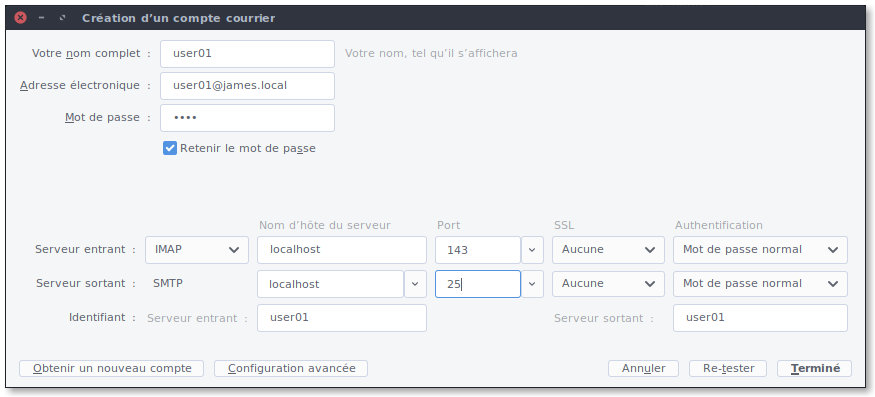

# Configure Thunderbird to access and send James' users' mails

So if you have for example a user with:

  - Email adress: `user01@james.local`

  - Password: `1234`

**Incoming server:**

  - Protocol: `IMAP`

  - Host: `localhost`

  - Port: `143`

  - SSL: `none`

  - Authentication: `normal`

  - username: `user01`

**Outgoing server:**

  - Protocol: `SMTP`

  - Host: `localhost`

  - Port: `25`

  - SSL: `none`

  - Authentication: `normal`

  - username: `user01`

and that's it! You will be aible to send and receive messages using IMAP 
and SMTP.
