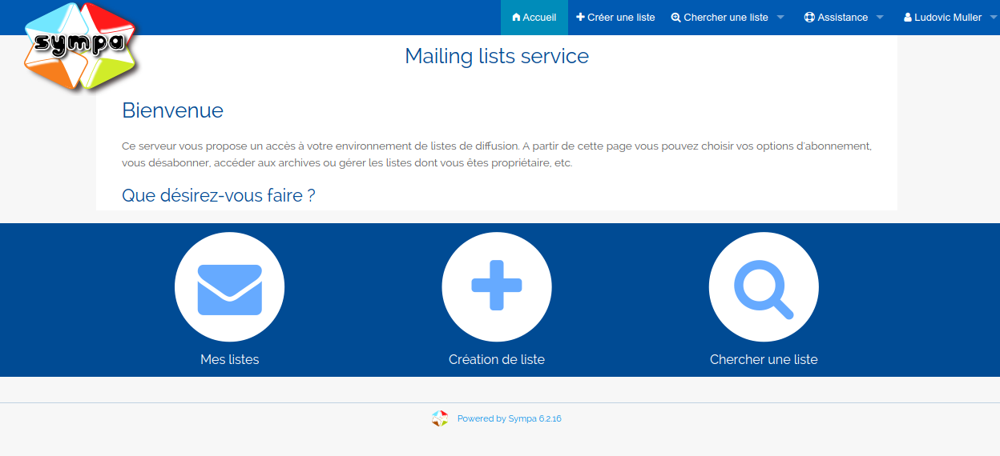

# Présentation du logiciel Sympa

Sympa (Système de Multi-Postage Automatique) est un gestionnaire de 
listes électroniques libre (diffusé sous licence 
[GPL](https://www.gnu.org/copyleft/gpl.html)) écrit en Perl développé 
sous la responsabilité de RENATER. La première version est sortie le 
premier avril 1997. Il permet d'automatiser les fonctions de gestions des 
listes telles que les abonnements, la modération et la gestion des 
archives, et propose une interface web complète pour gérer les listes.

Sympa est utilisé par la grande majorité des établissements 
d'enseignement supérieur et de recherche français, et est également très 
largement utilisé dans les milieux académiques internationaux tout comme 
par de nombreuses organisations (NASA, Unesco, ...), des ministères 
(affaires étrangères, culture, défense, finances, ...) et certains 
hébergeurs.

Les sources sont actuellement disponibles sur le dépôt GitHub suivant :
`https://github.com/sympa-community/sympa`.

Sur la capture d'écran ci-dessus, on peut par exemple voir que l'on peut 
facilement trouver les listes auxquelles on s'est abonné, créer une liste 
ou bien en chercher une rapidement.
