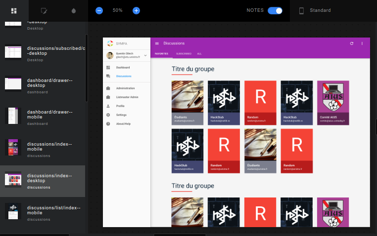
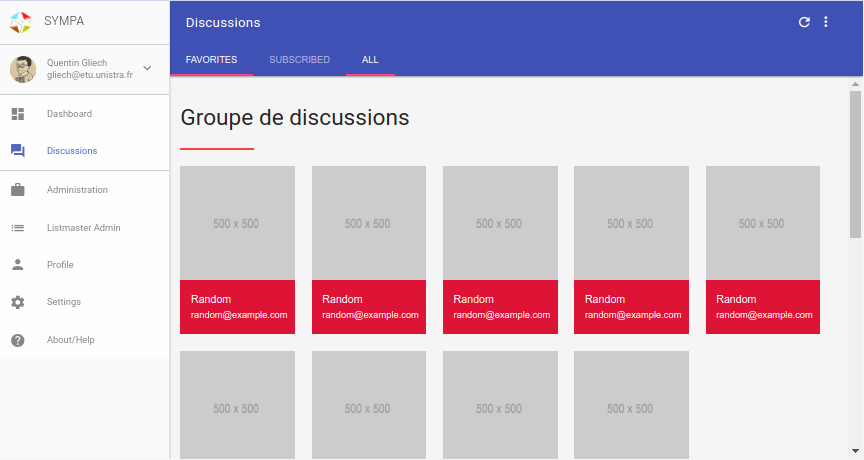
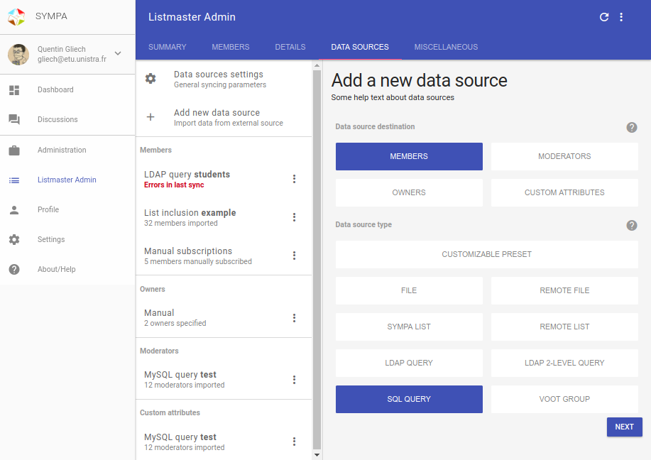
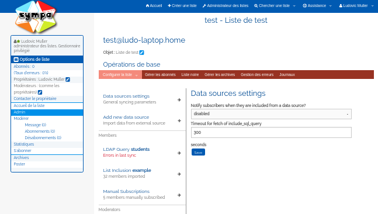

# Travail réalisé

## Intégration de maquettes

Quentin me fournissait des maquettes qui montraient à quoi devrait 
ressembler les différentes pages de la future interface de Sympa.

Je devais donc faire en sorte de créer les différentes pages, de créer 
les routes vers chacune de ces pages, d'identifier et de créer les 
différents composants, et faire en sorte que le tout se rapproche le plus 
possible des maquettes en utilisant VueJS.

Lors du hackathon, nous avons décidé d'utiliser le *Material Design*, qui 
est un concept de design pensé par Google, qui définit certaines règles 
s'appliquant à l'interface graphique des logiciels et applications. Vu 
que les utilisateurs ont déjà l'habitude d'utiliser ce style d'interfaces,
 notamment dans les applications Android ou certains autres sites, 
l'utilisateur ne sera donc pas perdu et trouvera ses marques assez 
rapidement sur la nouvelle version de Sympa, qui elle se veut nettement 
plus accessible que la version actuelle.

Au départ on utilisait le projet [`vue-material`](http://vuematerial.io) 
pour construire rapidement notre application VueJS, mais il se trouve, 
qu'après concertation avec Quentin, qu'il y avait un certain nombre de 
soucis de performances. Le nombre et la taille de calques lors des rendus 
dans le navigateur faisait planter l'inspecteur de Google Chrome dans 
certains cas, ce qui n'était pas très pratique.

On a donc fini par changer pour [`mdl`](https://getmdl.io/). Développé 
par Google directement, il était certain pour le coup que les questions 
de performances auraient été bien prises en compte, que ce serait donc le 
remplaçant idéal pour [`vue-material`](http://vuematerial.io), et nous 
auront toujours le *Material Design* que nous souhaitions. Cependant ce 
changement a nécessité une grande réécriture de code pour ma part, mais 
cela en valait la peine ! Après quelques jours de travail sur une 
nouvelle branche sur le dépôt, que j'ai nommée 
[`mdl`](https://github.com/sympa-community/sympa-vue/tree/mdl) pour 
l'occasion, j'ai réussi à faire en sorte d'avoir une interface qui 
ressemble à ce que j'avais auparavant, mais cela a nécessité la création 
de certains composants ainsi que de nombreuses retouches dans le CSS 
(=*Cascading Style Sheets*, feuille de style).

---

## Documentation

### JMAP

Lors de mon stage je devais aussi me documenter sur le fonctionnement 
d'un protocole qui se veut être le successeur d'IMAP, nommé JMAP.

**J**SON **M**eta **A**pplication **P**rotocol est un protocole créé dans 
le but de remplacer IMAP, en se voulant plus simple d'utilisation pour les 
développeurs, en retournant toutes les réponses sous forme d'objets JSON. 
Il a été conçu pour utiliser de manière plus efficace les ressources 
réseau et intègre des fonctionnalités particulièrement intéressantes, 
comme le mécanisme de *push*, qui permet de notifier un client du moindre 
changement (par exemple l'arrivée d'un nouveau mail) pour l'ensemble des 
répertoires, ce qui n'était pas possible avec IMAP, où on ne pouvait que 
surveiller un seul répertoire à la fois et nécessitait une connexion 
persistante.

Il se trouve que pour le moment Sympa utilise 
[`MHonArc`](https://www.mhonarc.org/) pour afficher les archives des 
mails des listes de diffusion depuis l'interface web, mais le remplacer 
par JMAP offrirait nettement plus de souplesse, puisque ce sera le client 
qui demandera directement les informations souhaitées; cela permettra une 
réelle séparation entre le *back-end* et le *front-end* à terme.

J'ai donc écrit une petite documentation pour montrer comment 
s'authentifier avec JMAP, notamment pour les points suivants :

  - Comment avoir un `continuationToken` ?

    *Il s'agit d'un jeton permettant de demander un `accessToken`.*

  - Comment avoir un `accessToken` ?

    *Il s'agit d'un jeton permettant d'effectuer des requêtes, tel que 
    récupérer les boîtes mail disponibles, récupérer les mails, ceux qui 
    ne sont pas encore lus, etc. L'utilisateur est identifié grâce à ce 
    jeton.*

  - Comment récupérer les différents *endpoints* ?

  - Comment révoquer un token ?

### Apache James

Maintenant que j'avais les informations théoriques nécessaires, j'ai 
souhaité construire un petit client dans l'interface de Sympa pour mettre 
en pratique le système d'authentification et essayer de récupérer 
quelques données. J'avais donc besoin de trouver quelque chose qui puisse 
être capable de me fournir un *endpoint* sur lequel je pouvais effectuer 
des requêtes. Ce fût assez difficile à trouver, mais j'ai finis par 
tomber sur [`Apache James`](https://james.apache.org/). Cependant en 
suivant les instructions sur leur site, je n'étais pas en mesure de faire 
fonctionner JMAP, alors que sur leur page d'accueil ils annonçaient 
pourtant bien un support de ce protocole. J'ai donc décidé de contacter 
directement les développeurs du projet afin de voir comment faire. Après 
discussion avec eux, je suis donc parvenu à obtenir ce que je souhaitais, 
et j'ai donc également choisis de documenter les étapes nécessaires pour 
montrer les étapes à suivre pour l'installer avec le support de JMAP, 
comment ajouter un utilisateur, et comment se connecter avec Thunderbird 
avec cet utilisateur, pour tester le bon fonctionnement de James.

### Emplacement de la documentation

J'ai décidé de publier l'ensemble de la documentation que j'ai rédigé en 
langue anglaise sur un dépôt GitHub dont voici le lien :
`https://github.com/ludovicm67/sympa-internship/tree/master/docs`
(en anglais); le fichier 
[`README.md`](https://github.com/ludovicm67/sympa-internship/blob/master/README.md) 
se trouvant à la racine du dépôt explique comment les compiler sous forme 
de pdf avec l'aide de `pandoc`.

Dans ce dépôt se trouve également mon *diary*, document dans lequel 
j'écrivais ce que je faisais chaque semaine, histoire d'avoir une trace 
chronologique de mon travail, et faciliter la rédaction de ce rapport, 
qui lui-même se trouve également à cet endroit.

## Création du client JMAP

J'ai donc créé un client JMAP avec JavaScript dans le but de contacter un 
serveur mail, pour mes tests il s'agissait d'Apache James que je venais 
de mettre en place. Tout fonctionne à merveille, la connexion, le listing 
des différentes boites mails et les indicateurs de mails non lus.

J'étais satisfait de mon travail, et je pense qu'il sera fortement utile 
pour la suite, lorsque l'on pourra directement effectuer une requête sur 
un *endpoint* exposé par le *back-end*, au lieu de passer par Apache James, 
qui ne m'étais utile que pour tester le bon fonctionnement de mon 
mini-client.

## Le composant `Datasources`

Comme je le disais avant, avec VueJS on aime bien travailler avec des 
composants qui peuvent être réutilisables.

Avec la communauté de Sympa, on s'est dit qu'il serait intéressant de voir 
si je pouvais déjà essayer d'intégrer un des composant de la nouvelle 
interface de Sympa dans la version actuelle, dans le but d'avoir des retours 
de la part des utilisateurs, pour voir si cela leur convient, et pour les 
préparer petit à petit à la nouvelle interface. Pour cela il fallait choisir 
un composant qui n'avait pas besoin de stocker de données et d'interagir 
beaucoup avec le serveur; le choix s'est donc porté sur composant 
`Datasources`. Ce composant permet de choisir rapidement les sources de 
données pour les listes, par exemple il est possible de dire *tous les 
utilisateurs de cette base de données doivent être automatiquement inscrit à 
telle liste de diffusion*.

J'ai donc créé dans un premier temps une branche 
[`datasources`](https://github.com/sympa-community/sympa-vue/tree/datasources) 
dans la partie front, dans le but d'avancer au maximum sur ce composant dans 
la nouvelle version de Sympa.

J'ai ensuite créé une nouvelle branche dans le dépôt du logiciel en lui-même, 
[`feat-ui-datasources`](https://github.com/sympa-community/sympa/tree/feat-ui-datasources), 
dans laquelle j'ai fait en sorte d'intégrer le composant VueJS des sources de 
données dans l'interface actuelle.

J'ai donc dans un premier temps dû analyser le code source, pour repérer où 
se trouvent les fichiers de *template*^[Un fichier de *template* est un 
fichier dans lequel on écrit ou génère du code HTML], et voir comment est-ce 
que le tout fonctionnait. J'ai pu voir qu'il s'agissait de *templates* au 
format `tt2`, j'ai donc dû me documenter pour trouver comment est-ce que ce 
langage de template fonctionne, ce qui n'était pas spécialement compliqué.

Cependant pour tester ce que je faisais, j'avais besoin de travailler sur 
une instance de Sympa basée sur les sources en développement, car les 
versions packagées actuellement sur les distributions n'est pas 
suffisamment à jour pour que je puisse travailler dessus. En effet, les 
fichiers de *templates* ont été complètement retravaillés entre-temps. J'ai
eu quelques difficultés à installer Sympa depuis les sources, car je 
rencontrais certains soucis de dépendances, mais au final j'ai installé 
en parallèle la version packagée, et fait en sorte de faire pointer le 
serveur web vers les sources directement, ce qui a parfaitement fonctionné.

J'ai donc pu travailler sur les fichiers de *templates* et tester directement 
en local ce que ça donnait. Cependant j'avais un peu de mal à me repérer 
au départ, car il y a un grand nombre de variables utilisées, et je n'arrivais 
pas à afficher le contenu de certaines variables pour els inspecter. J'ai donc 
demandé à la communauté de Sympa depuis le salon IRC, et on m'a dit qu'il était 
possible d'afficher le contenu des variables en activant un paramètre un peu 
caché quelque part dans les menus. J'ai donc pu comprendre la logique, et 
construire le composant des sources de données dans la version actuelle de 
Sympa, ce qui permet au final à l'utilisateur de beaucoup mieux s'y retrouver, 
car avant il s'agissait une longue page remplie de champs de formulaires à 
compléter qui était très longue et très austère, avec des champs de sélections 
qui contenaient énormément d'éléments; désormais on a un menu qui récapitule 
les différentes sources disponibles, que l'on peut facilement trouver pour 
les éditer, la création d'une source de données est également nettement plus 
agréable.

