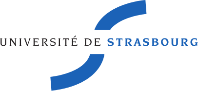

Université de Strasbourg

Cursus Master Ingénierie Informatique, systèmes et réseaux

2ème année

## Sujet du stage

Le futur du frontend de Sympa, un gestionnaire de listes électroniques 
libre.

## Dates du stage

Du 22/05/2017 au 30/06/2017.

## Auteur

Ludovic Muller

## Responsables

  - Enseignant référent :
    Stéphane Cateloin
  
  - Tuteur de stage :
    Laurent Gydé,
    Directeur technique
