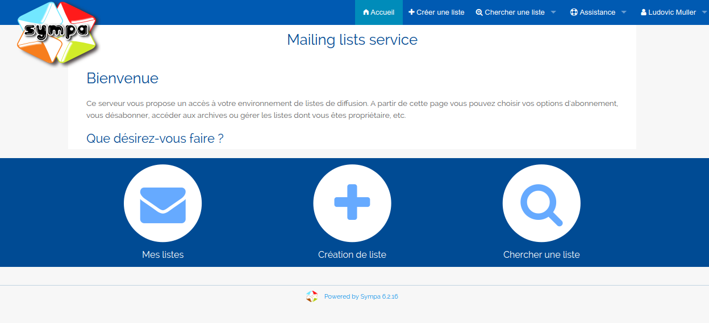

Université de Strasbourg

Cursus Master Ingénierie Informatique, systèmes et réseaux

2ème année

## Sujet du stage

Le futur du frontend de Sympa, un gestionnaire de listes électroniques 
libre.

## Dates du stage

Du 22/05/2017 au 30/06/2017.

## Auteur

Ludovic Muller

## Responsables

  - Enseignant référent :
    Stéphane Cateloin
  
  - Tuteur de stage :
    Laurent Gydé,
    Directeur technique

## Remerciements

Je tiens tout d'abord à remercier RENATER pour m'avoir pris en tant que 
stagiaire pour travailler sur Sympa. Cela a été une véritable opportunité 
pour moi de contribuer à un projet opensource.

Merci à Stéphane Cateloin 
et Laurent Gydé, mes deux 
responsables de stage.

Je remercie le département informatique de l'Université de Strasbourg 
dans la globalité, notamment pour m'avoir accueilli dans leur locaux, et 
de m'avoir préparé un burau dans l'openspace.

Un grand merci à toutes les personnes de l'openspace que j'ai pu cotoyer 
durant ces quelques semaines, pour toutes les discussions intéressantes 
que l'on a pu avoir, et pour les pauses de midi où j'ai pu manger et 
jouer avec certain d'entre eux.

Enfin, je tiens particulièrement à remercier Marc Chantreux, car c'est grâce à lui 
que le Hackathon fêtant les vingt ans de Sympa a pu être organisé, 
rassemblant ainsi une partie de la communauté, que je remercie également 
au passage, durant deux jours afin de discuter du futur du projet, et que 
mon stage a pu se réaliser.

Un immense merci encore à Quentin Gliech, pour m'avoir fait découvrir Sympa et pour ses 
maquettes, sa disponibilité et ses conseils.

# Introduction

J'ai fait le choix de m'orienter en Cursus Master Ingénierie Informatique,
 Systèmes et Réseaux à l'Université de Strasbourg en partie pour la 
proximité avec le monde de l'entreprise, avec un certain nombre de stages 
à effectuer. Cela permet d'acquérir de nombreuses connaissances 
supplémentaires ainsi qu'une véritable expérience professionnelle, qui ne 
pourra qu'être bénéfique pour nous aider à nous lancer par la suite sur 
le marché du travail.

Ce stage, qui était faciltatif, réalisé du 22 mai au 30 juin 2017 dans le 
cadre de la deuxième année de CMI permet de confirmer mon orientation 
dans le monde de l'informatique. Ce rapport de stage a pour but de 
présenter le travail réalisé tout au long de mes six semaines de stage. 
Le sujet de mon stage concerne le futur du frontend de Sympa, un 
gestionnaire de listes électroniques libre.

Ce stage fait suite au hackathon organisé à l'Université de Strasbourg 
les deux premiers jours d'avril, à l'occasion des vingt ans de Sympa. 
C'était l'occasion pour moi de décrouvrir ce projet, de discuter de son 
avenir, et de faire connaissance avec la communauté.

C'était également l'occasion de définir les contraintes pour la nouvelles 
version de Sympa. Pour la partie frontend :

  - **Utiliser VueJS :** avantage du fonctionnement par composants, 
  gestion du routing assez simple, performances (ne change que ce qui 
  doit être changé), …

  - **Utiliser le Material design :** les utilisateurs sont désormais 
  habitués à utiliser ce type d’interface, ils ne seront pas trop 
  dépaysés. De plus se forcer à suivre des règles de design nous assure 
  de ne pas trop diverger et assurer ainsi une certaine cohérence.

J'aurais l'occasion de revenir sur ces points dans la suite de ce rapport.

# Présentation du lociciel Sympa

Sympa (Système de Multi-Postage Automatique) est un gestionnaire de 
listes électroniques libre (diffusé sous licence 
[GPL](https://www.gnu.org/copyleft/gpl.html)) écrit en Perl développé 
sous la responsabilité de RENATER. La permière version est sortie le 
premier avril 1997. Il permet d'automatiser les fonctions de gestions des 
listes telles que les abonnements, la modération et la gestion des 
archives, et propose une interface web complète pour gérer les listes.

Sympa est utilisé par la grande majorité des établisssements 
d'enseignement supérieur et de recherche français, et est également très 
largement utilisé dans les milieux académiques internationaux tout comme 
par de nombreuses organisations (NASA, Unesco, ...), des ministères 
(affaires étrangères, culture, défense, finances, ...) et certains 
hébergeurs.

Les sources sont actuellement disponibles sur le dépôt GitHub suivant :
`https://github.com/sympa-community/sympa` .

Sur la capture d'écran ci-dessus, on peut par exemple voir que l'on peut 
facilement trouver les listes auxquelles on s'est abonné, créer une liste 
ou bien en chercher une rapidement.

# Organisation du stage

## Présentation de l'entreprise et des lieux de travail

J'ai effectué mon stage chez RENATER.
Le groupement d'intérêt public Réseau National de télécommunications pour 
la Technlogie l'Enseignement et la Recherche, créé en 1993, est le réseau 
informatique français qui relie les différentes universités et les 
différents centres de recherches entre eux.
RENATER propose un certain nombre de services, –réseaux et applicatifs 
notament–, dont ce dernier contient Sympa.

Cependant, pour des soucis pratiques, j'ai effectué mon stage dans les 
locaux du département informatique de l'Université de Strasbourg, qui 
étaient organisés sous forme d'open-space, ainsi que depuis chez moi de 
temps en temps. En effet, vu que je travaillais en totale autonomie, cela 
ne posais pas de problème.

## Objectifs du stage

Ma mission principale de mon stage était d'intégrer [`les maquettes 
réalisées par Quentin Gliech`](https://s.sandhose.fr/sympa/spec/) dans le 
projet, c'est-à-dire réaliser le design de sorte à ce qu'il ressemble le 
plus possible aux spécifications fournies.

Je devais également me renseigner sur le protocole JMAP, le protocole que 
l'on utilisera par la suite pour exposer les archives des listes de 
diffusion dans l'interface web.

## Les outils utilisés

J'ai choisis de travailler sur mon ordinateur personnel durant ce stage, 
car j'avais déjà tout le nécessaire qui était en place. J'ai cependant 
choisis, au cours de mon stage de passer de la distrubition Ubuntu à une 
distribution Debian, dans le but d'assurer la compatibilité de mes 
travaux avec le plus grand nombre de machines possible.

Je vais présenter ici brièvement les différents outils que j'étais amené 
à utiliser.

### Le versionning avec `git`

Versionner son projet est vraiment quelque chose de primordial. Pouvoir 
revenir en arrière, travailler avec différentes branches, travailler à 
plusieurs sur un même projet, `git` est vraiment l'outil idéal !

Il s'agit du logiciel de gestion de version décentralisé le plus 
populaire, puisqu'il est utilisé par plus de douze millions de personnes.

Lors du hackathon, nous avions créé un dépôt 
[`sympa-vue`](https://github.com/sympa-community/sympa-vue) sur GitHub, 
accessible depuis `https://github.com/sympa-community/sympa-vue`, c'est 
sur ce dépôt que j'ai principalement travaillé durant mon stage.

### L'environnement de développement

L'environnement de développement tourne dans un environnement NodeJS. 
[`Webpack`](https://webpack.js.org/) est utilisé pour permettre le *hot 
reload*, ce qui nous permet de voir les modifications en direct du front 
lorsque l'on développe.

Pour assurer une certaine cohérence dans la manière de coder, le linter 
JavaScript [`ESLint`](https://eslint.org/) est utilisé.

Pour utiliser dès maintenant les nouveaux standards JavaScript, notament 
l'ECMAScript® 2015, [`Babel`](https://babeljs.io/) est utlisé, ce qui 
permet de transpiler le code et le rendre compatible avec les anciens 
navigateurs ne supportant pas encore ces nouveaux standards.

### L'intégration continue

Pour l'intégration continue, [`Travis CI`](https://travis-ci.org/) était 
utilisé. Du coup à chaque fois que l'on push quelque chose sur le dépôt, 
ça va exécuter les tests, et voir si tout fonctionne correctement.

Lors d'un push sur la branche `master`, et que le tests réussi, le code 
est déployé sur `http://sympa-vue.surge.sh/` avec l'aide de 
[`surge.sh`](http://surge.sh/). Cependant lors d'un grand changement de 
technologie pour le frontend, j'ai décidé de travailler sur d'autres
branches.

# Travail effectué

@TODO: à compléter !!

# Conclusion

@TODO: à remplir

# Bibliographie

  * À propos de RENATER :
    - `https://www.renater.fr/`
      (site web de RENATER)
    - `https://fr.wikipedia.org/wiki/RENATER`
      (page Wikipédia de RENATER)

  * À propos de Sympa :
    - `https://www.sympa.org/`
      (site web de Sympa)
    - `https://www.sympa.org/users/custom`
      (liste des utilisateurs de Sympa)
    - `https://www.renater.fr/logiciel-sympa`
      (page de présentation de Sympa depuis le site de RENATER)
    - `https://fr.wikipedia.org/wiki/Sympa_(informatique)`
      (page Wikipédia de Sympa)

  * Dépots GitHub de Sympa sur lesquels j'ai pu travailler :
    - `https://github.com/sympa-community/sympa`
      (le dépôt principal)
    - `https://github.com/sympa-community/sympa/tree/feat-ui-datasources`
      (la branche que j'ai créé pour ajouter le nouveau composant dans la 
      version actuelle)
    - `https://github.com/sympa-community/sympa-vue`
      (le dépôt du frontend de la future version de Sympa)
    - `https://github.com/sympa-community/sympa-vue/tree/mdl`
      (la branche créée pour passer de `vue-material` à `mdl`)
    - `https://github.com/sympa-community/sympa-vue/tree/datasources`
      (la branche créée pour ajouter le composant des `Datasources`)

  * Les principales technologies utilisées :
    - `https://www.debian.org`
      (page web de la distribution Linux Debian)
    - `https://fr.wikipedia.org/wiki/Git`
      (page Wikipédia de `git`)
    - `http://www.ecma-international.org/ecma-262/6.0/`
      (page de spécifications de l'ECMAScript® 2015)
    - `https://nodejs.org/`
      (site web de NodeJS)
    - `https://vuejs.org/`
      (site web de VueJS)
    - `http://vuematerial.io`
      (site web du projet *Vue Material*)
    - `https://getmdl.io/`
      (site web de *Material Design Lite*)
    - `http://jmap.io/`
      (site web des spécifications du protocole JMAP)
    - `https://webpack.js.org/`
      (site web de Webpack)
    - `https://eslint.org/`
      (site web d'ESLint, le linter JavaScript utilisé)
    - `https://babeljs.io/`
      (site web de Babel, le transpiler utilisé)
    - `https://travis-ci.org/`
      (site web de Travis CI, un logiciel d'intégration continu utilisé)
    - `http://surge.sh/`
      (site web de Surge.sh, utilisé pour les déploiements sur `master`)
